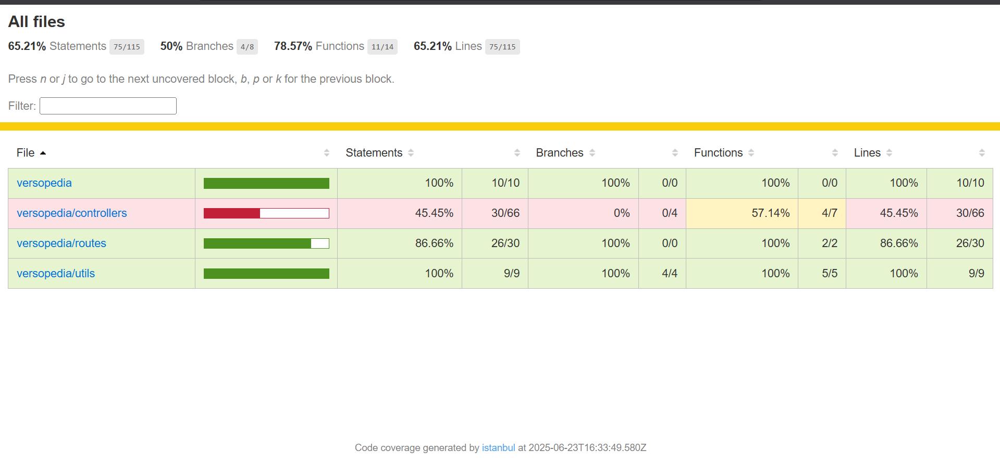
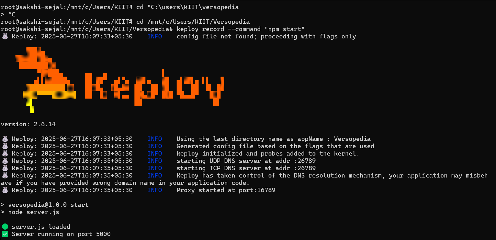

# 🌸 Versopedia  
*A Poetry & Reflection API that speaks in code and soul.*

> “In lines of logic and verses made,  
> A vault of thoughts, both bold and staid.  
> Code meets calm where feelings rest,  
> This API gives words a vest.”

---

## 🌼 What is Versopedia?

Versopedia is a custom-built RESTful API server that brings poetry and reflections to life.

- 📜 Fetch a **Poem of the Day**  
- ✍️ Submit a **personal reflection**  
- 🔁 Update or delete past thoughts  
- 🔎 Discover what others have penned  

It’s a **quiet haven in JSON** — where the heart speaks and the server listens.

---

## 🔧 Tech Behind the Tapestry

| Layer        | Tools Used                            |
|--------------|----------------------------------------|
| Server       | Node.js, Express.js                    |
| Database     | PostgreSQL, Prisma ORM                 |
| Testing      | Jest, Supertest                        |
| Environment  | dotenv                                 |
| Validation   | Custom utils for input handling        |

---

## 📂 Folder Flow

```
versopedia/
├── controllers/        # Logic for poems & reflections
├── routes/             # API routes
├── tests/              # Unit, Integration, API tests
│   ├── api/
│   ├── integration/
│   └── unit/
├── prisma/             # DB schema and migrations
├── utils/              # Helper functions (sanitize, validate)
├── coverage/           # Coverage report
└── README.md
```

---

## 🧪 Test Coverage

This project was not only made with passion,  
But **tested with precision**.

| Metric      | Coverage   |
|-------------|------------|
| Statements  | **65.21%** |
| Branches    | **50.00%** |
| Functions   | **78.57%** |
| Lines       | **65.21%** |

📸 **Screenshot**:  

>   
> _Even the bugs find no place to hide._

---

## 🚀 How To Use the Magic

### 📥 Clone the project
```bash
git clone https://github.com/sakshiSejal296/versopedia-tested.git
cd versopedia-tested
```

### ⚙️ Setup the Environment
Create a `.env` file:
```env
DATABASE_URL="postgresql://<your-db-url>"
```

### 📚 Run Migrations
```bash
npx prisma migrate dev
```

### 🧪 Run the Tests
```bash
npm install
npm test
npx jest --coverage
```

---

## ✨ Features You’ll Love

- 🌅 **Poem of the Day**: Served fresh and inspiring  
- 📝 **Reflections**: Users can express their own  
- 🧹 **Clean & Secure**: Input sanitized and validated  
- 🧪 **Thoroughly Tested**: Unit + Integration + API coverage  

---

## 🌻 For the Soul Who Coded This

> Developed by **Sakshi Priya**,  
> who believes both poetry and programming  
> are ways of loving the world — quietly, precisely.

📍 Bhubaneswar, India  
🔗 [GitHub Profile](https://github.com/sakshiSejal296)

---

## 📖 License

**MIT License** – Use it, fork it, love it.  
Because beauty deserves to be open-source. 💫

---

> “Between HTTP and heartfelt lines,  
> This vault was carved in silent times.  
> Now you may build, reflect, and grow —  
> For even APIs let emotions flow.” 🌿

---

## 🧪 API Testing with Keploy + CI/CD Integration

This project uses [Keploy](https://keploy.io) for intelligent API test generation and CI/CD integration.

### ✅ What Keploy Does:
- Records API calls & generates tests from real traffic
- Replays test cases on each build to catch regressions
- Uploads results to [Keploy Dashboard](https://app.keploy.io)

---

## 📸 Keploy Test Report

> 🖥️ Keploy recording in terminal:



> ✅ Auto-generated API test result report:


---

## ⚙️ GitHub Actions CI/CD

Automated test execution is powered by **GitHub Actions**.

📁 [CI Workflow File](https://github.com/sakshiSejal296/versopedia-tested/blob/main/.github/workflows/keploy.yml)

Each commit runs:
- Keploy tests
- Coverage checks
- Result reporting

You can view live CI status under the [Actions tab](https://github.com/sakshiSejal296/versopedia-tested/actions).

---

## 🐳 Docker Setup for Keploy

To run tests inside Docker:

### ▶️ Record Mode
```bash
docker build -t versopedia-keploy .
docker run --rm -it -p 5000:5000 versopedia-keploy
```

### 🔁 Test Replay Mode

Update your `Dockerfile` to:
```Dockerfile
CMD ["keploy", "test", "--command", "npm start"]
```

Then:
```bash
docker build -t versopedia-keploy .
docker run --rm -it -p 5000:5000 versopedia-keploy
```

---

## 📜 OpenAPI Docs

Run the app and go to:

```
http://localhost:5000/api-docs
```

For auto-generated Swagger documentation.

---

> “Even testing becomes poetry when the process flows effortlessly.” 🧪🌿
